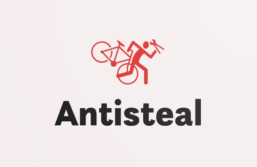

### Prevent users from downloading your mods from reposting sites or malicious providers.

Powered by [the reposting site list from StopModReposts](https://github.com/StopModReposts/Illegal-Mod-Sites/wiki/API-access-and-formats)

### Important Infomation

[**Infomation on the library working on Linux, reason why Linux is unsupported.**](/info/LINUX.md)

[**When should I, and when shouldn't use this?**](/info/SIU.md)

[**How does it work? And is it safe?**](/info/OHN.md)

### Usage

Not currently available yet/requires further development - check back later!

