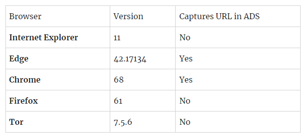

# How does it work? And is it safe?

AntiSteal uses numerous methods to check where a file is downloaded. It varies between platforms.

AntiSteal **does not** read personal infomation, it only reads the download location and referral location (Where the download button was clicked etc.) of the file.

### Windows

AntiSteal reads the jar's Zone.Identifier, this is a small Alternate Stream or commonly known as ADS.
For more infomation, [checkout this handy SuperUser post that explains it very well - better than I can explain.](https://superuser.com/a/695529)

However, Zone.Identifier is only properly filled by the following browsers - however, this is not a problem as most mod users that fall for reposting sites and scams are using Chrome or Edge:

### MacOS

File download location is stored in the Extended Attributes - more specific the `kMDItemWhereFroms` attribute, you can view these attributes on any downloaded file using [this tutorial.](https://osxdaily.com/2018/05/03/view-remove-extended-attributes-file-mac/)

All downloaded files require this attribute to comply with Apple Security Policies.

### Linux

Linux is not supported, and cannot be supported - [for more infomation, see here.](/LINUX.md)